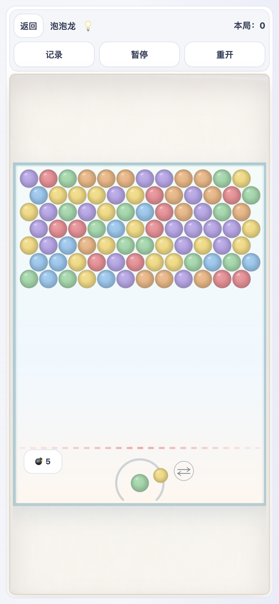

# 泡泡龙 1.0.4 柔和彩球验收

本次调整恢复最初版本的粉彩六色：红 `#f28b94`、蓝 `#8fc7ee`、绿 `#96d7a7`、黄 `#f3d878`、紫 `#b9a4e8`、橙 `#efb37e`。六色平均 RGB 色度从上一版基础色的 140.7 降到 94.5，同时任意两色的 CIE Lab 距离均大于 24，降低刺激感但仍可只靠颜色区分。

运行时不再解码高饱和并带外发光的 `bubbles-v4.png`。每个颜色和显示尺寸只生成并缓存一次完整圆球，使用较窄的明暗梯度、细边缘和低强度高光，不绘制形状、中心符号或外发光。

自动化结果：共享套件 369/369 通过；泡泡龙颜色、圆形边缘、缓存和动画专项 14/14 通过。真实浏览器触控回归覆盖省电、普通、游戏三档画质，以及发射、换球、暂停、冷启动存档、320px 窄屏和禁用旧图片资源后的正常游玩，结果见 [浏览器验收记录](evidence/bubbles-pastel-v5/browser/result.json)。
