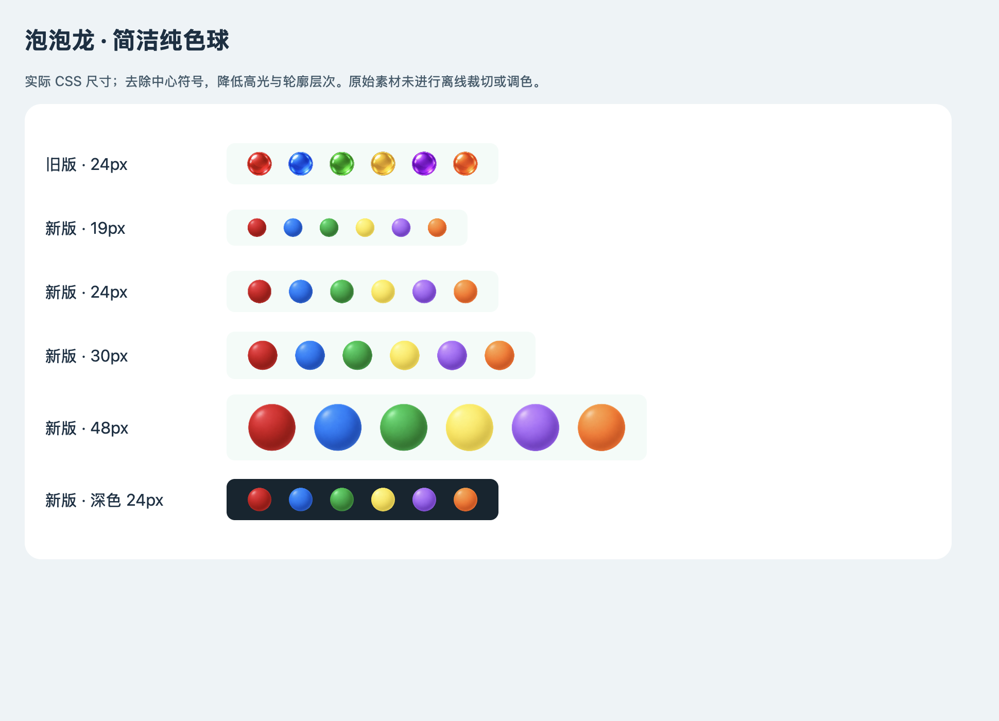

# 泡泡龙 1.0.3：简洁纯色球

2026-09-09。按用户最终要求去掉全部中心符号，仅以六种差异化颜色和简洁圆球进行辨认。红、蓝、绿、黄、紫、橙各自保留稳定颜色身份，黄更浅、紫偏浅紫，降低与橙、蓝的混淆；取消厚玻璃圈与大面积强反光，保留轻微立体明暗。

当前球和下一颗保持较大预览；棋盘、飞行、掉落、预览和图片加载失败的替代绘制都不含符号。射击、计分、物理时序与存档 schema 保持。

## 素材与包

内置 imagegen 生成的最终原图：[bubbles-v4.png](../assets/game-art/paopao/bubbles-v4.png)，1536×1024 RGBA、1,529,063 字节。[完整最终提示词](art-prompts/bubbles-v4.txt)；原图未作离线编辑。[透明度与完整边缘](evidence/bubbles-v4/source-alpha.json)逐格验证；渲染使用完整400×400源区域，无附加圆形裁剪。

泡泡龙游戏与专属美术版本均为1.0.3。旧版符号图仅保留在历史证据中，不进入新版游戏资源包。缓存保留48项/2MiB上限，按实际DPR和尺寸缓存；静态棋盘不重复绘制，加载后刷新，退出后不接受迟到回调。

## 验收

前置检查：[自动检查324/324](evidence/bubbles-v4/host-tests.txt)；[浏览器真实触控](evidence/bubbles-v4/browser/result.json)验证三档性能模式、换球发射、暂停、冷启动保存、窄屏和图片失败回退。浏览器结果不代替 Android 真机与模拟器验收，最终原生结果随正式发行补齐。

历史content8的[符号版资料](bubble-visibility-v3-history.md)仅用于追溯；用户最终选择本页的无符号纯色版。
