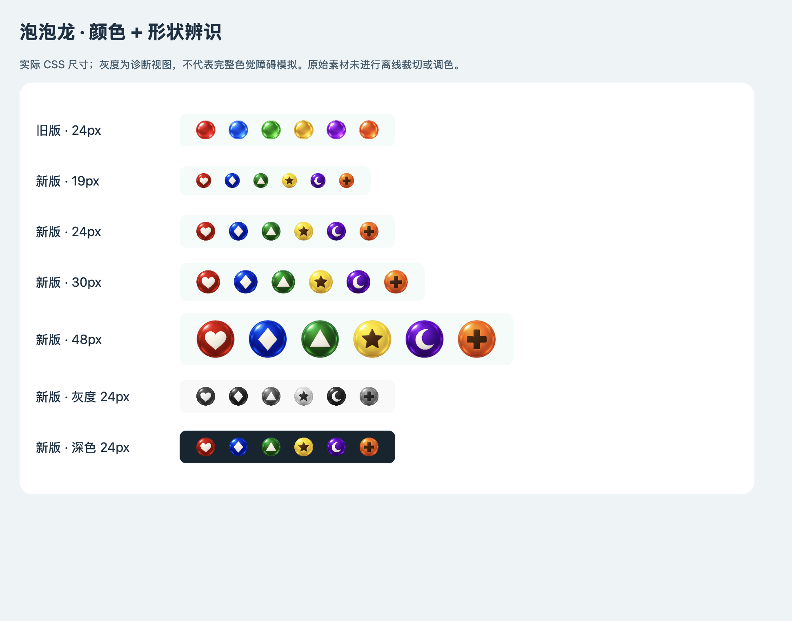

# 泡泡龙 1.0.2：历史验收记录

2026-09-09。此版已被后续纯色简化版取代，保留当时证据。针对用户反馈的颜色区分度不足，重新生成并替换泡泡龙六色球素材。玩法与旧局颜色身份保持一致，游戏和美术包各自升到 1.0.2。

## 改动

旧球只有色相差异，玻璃反光的轮廓与亮度结构相似；实际格距只有 19–30 CSS 像素，下一颗球还会缩到格距的 52%。新版保持饱和色主体，在球心增加稳定的形状线索：

| 颜色身份 | 球心标记 |
| --- | --- |
| red | 白色爱心 |
| blue | 白色菱形 |
| green | 白色三角 |
| yellow | 深色五角星 |
| purple | 白色月牙 |
| orange | 深色十字 |

棋盘、飞行、掉落、当前球与下一颗使用同一映射。下一颗预览由原直径的 52% 提高到 80%，当前球由 88% 提高到 98%。图片不可用时也显示对应的颜色与图形。

灰度图用于检查非颜色线索，不等同于完整色觉障碍仿真或用户研究。

## 素材与性能

- 使用 **内置 imagegen** 生成，[完整提示词](art-prompts/bubbles-v3.txt)。
- 最终原图：[assets/game-art/paopao/bubbles-v3.png](evidence/bubbles-v3/bubbles-v3-original.png)，1536×1024 RGBA，1,720,036 字节；保留生成结果，没有离线裁切或调色。
- [源图透明度与边缘检查](evidence/bubbles-v3/source-alpha.json)：六个正方形源区域都包含完整球体，四角透明，不额外套圆形裁剪。
- 独立加载器按实际显示尺寸与 DPR 缓存小图，静态棋盘不逐帧重绘；图片解码后刷新当前棋盘，退出后停止该回调。
- 新图属于 `art.paopao`，新绘制代码属于 `game.paopao`。共享美术、核心、其他游戏包和 APK 不因本次替换改变。

## 验收与发布

- [完整自动检查](evidence/bubbles-v3/host-tests.txt)：324/324 通过，涵盖新素材加载/缓存/失败回退与原有帧率无关运动。
- [真实浏览器触控](evidence/bubbles-v3/browser/result.json)：三档性能模式、换球与发射、静止/暂停零新增绘制、保存冷启动、320 窄屏及图片加载失败仍可玩通过，运行时异常为 0。
- [实际普通模式棋盘](evidence/bubbles-v3/browser/normal-board.png)及[图片不可用时的替代绘制](evidence/bubbles-v3/browser/asset-failure-fallback.png)已目视检查。

正式发行：[资源 1.3.2 / content-8](https://github.com/JackLee992/USER_HOUSE_GAME_PACKS/releases/tag/content-8)。从资源 1.3.1 更新仅两包，共 1,877,422 字节（约 1.79 MiB）；其余 79 个包的完整清单对象不变，APK 无需更新。较早资源版本按其已有包补齐差异。

源码提交 `869f3c52f85f66920c40c59e66e4d2eb4cface0c`；快照 `5beaba8e7a4498dea68dd9dddad4f2c4b07fd1968cea03fad84febf0542b4c22`。已以 APK 固定公钥验签，并验证变化 ZIP 的 CRC、全部文件哈希及 GitHub 上传资产的大小与 SHA-256。[包验证](evidence/bubbles-v3/package-validation.json) · [上传资产验证](evidence/bubbles-v3/draft-asset-validation.json)。后续 APK 构建的内置清单同步指向该已签名快照，测试设备仍使用原正式 APK。

Android 正式 APK 的原生更新验收结果归档于 [evidence/bubbles-v3](evidence/bubbles-v3)。
