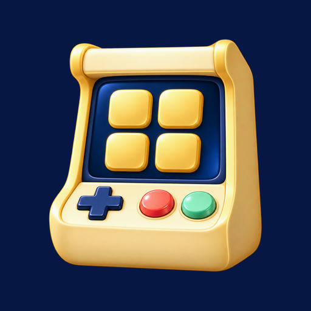
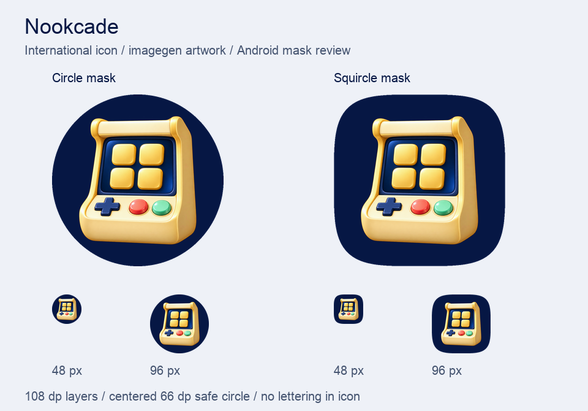

# 海外品牌提案 · Nookcade

推荐海外工作名 **Nookcade**，读作 **NOOK-kayd**。名字由 *nook*（自己舒服的小角落）和 *arcade*（街机厅）组合，承接“玩吧／玩伴小屋”的轻松陪伴感，也能覆盖纸牌、棋类、益智和动作小游戏。中文继续使用“玩吧”，国际图标统一使用无文字街机符号。

本次已生成并检查实物素材，文件位于 `assets/app-brand/international/`。现有应用图标、原生资源和运行时代码未修改。

## 三个候选名与公开检索

检索日期：**2026-09-08**。范围为公开网页，以及 Google Play、Apple App Store 的已索引名称；对明确撞名的结果进一步打开来源页面。完整查询词和访问限制见 `assets/app-brand/international/name-search.json`。

| 候选 | 含义与读法 | 已见同名情况 | 建议 |
| --- | --- | --- | --- |
| **Nookcade** | nook + arcade；NOOK-kayd；8 个字母，有“自己的小街机厅”含义 | 本次精确词、商店域名及日／韩音译检索未见同名 App 结果 | **作为工作名继续使用**；名称有辨识度，需用副标题解释离线游戏集合 |
| **JoyDeck** | joy + deck；JOY-dek；7 个字母，能表达一叠快乐游戏 | [AppBrain 有同名 iOS App 记录](https://www.appbrain.com/appstore/joydeck/ios-6792247766)，另有运营中的 [JoyDeck 平台](https://myjoydeck.com/) | 排除，名称检索容易混淆 |
| **Taploft** | tap + loft；TAP-loft；7 个字母，点按进入游戏小屋 | 已有同名游戏开发商；其[公司资料](https://www.linkedin.com/company/taploft)及[移动游戏记录](https://www.taptap.io/es/app/47803)均可见 | 排除，同行业既有使用明显 |

“未见结果”仅描述这次公开索引检索，不表示所有地区商店都无重名，也不表示商标或域名已经完成清查。商店直接搜索页本次未取得可读内容，不能当作全地区上架名称验证。

## 五种语言的显示名

启动器名称短，商店标题保留可搜索的 Nookcade 拼写；中英文无需把地域或内核版本放进品牌名。系统版／兼容版仍属于技术分发选择。

| 语言 | 启动器显示名 | 商店标题建议 | 简短介绍建议 |
| --- | --- | --- | --- |
| 简体中文 `zh-CN` | 玩吧 | 玩吧：离线小游戏 | 随时开一局，小游戏都在这里。 |
| 繁體中文 `zh-TW` | 玩吧 | 玩吧：離線小遊戲 | 隨時玩一局，小遊戲都在這裡。 |
| English `en` | Nookcade | Nookcade: Offline Games | Your little arcade, ready whenever you are. |
| 日本語 `ja` | ヌックケード | Nookcade：オフラインゲーム | いつでも遊べる、あなたの小さなゲームセンター。 |
| 한국어 `ko` | 눅케이드 | Nookcade: 오프라인 미니게임 | 언제든 즐기는 나만의 작은 오락실. |

日文使用“ヌックケード”、韩文使用“눅케이드”作为统一音译建议，界面和商店不要混用其他音译。以上是品牌文案建议，不代表游戏文本已完成翻译。机器可读版本在 `localized-brand.json`。

## 图形方向

图标是一台圆润的奶油金迷你街机。深蓝屏幕中的四个大游戏格表示多游戏集合，下方方向键和红／绿按键明确“可以玩”；完整街机又把 Nookcade 的小街机厅含义直接表达出来。图形没有字母、数字或汉字，五种语言可共用。

沿用当前“玩吧”的深蓝 `#061744` 背景、奶油金主体、红／绿按键。增加清晰的体积和克制的高光，但不使用纹理噪点、小标签或复杂场景。金色轮廓是第一识别层，四格屏幕是第二层，按钮细节是近看时的补充。

本次使用 **内置 image_gen** 生成原始透明 PNG。完整提示词在 `imagegen-prompt.txt`，原始输出保存在 `foreground-source.png`（1254 × 1254，RGBA），未经代码重画。`render-assets.py` 只做缩放、居中、透明叠加和系统裁切预览，保留生成图的透明度。

## Android 适配与 48 像素检查

Android 的前景和背景均按 108 dp 设计，关键图形需留在中央 66 dp 安全区域内；颜色图标应分为独立前景、背景层。[Android 官方规范](https://developer.android.com/develop/ui/compose/system/icon_design_adaptive)

本包的两个图层均为 **1080 × 1080**。测量前景中 alpha ≥ 16 的有效像素，最大核心直径为 **64.46 dp**，通过 66 dp 圆形安全区；原始 alpha 没有被二值化。启动器静态预览使用中央 72 dp 视口，模拟圆形与超椭圆圆角形状。

已人工查看上图中的真实 48 px 和 96 px 预览：街机轮廓、四格屏幕和方向／操作键可辨，圆形与圆角裁切均未切掉主体。圆角预览是代表性超椭圆，具体厂商遮罩仍由启动器决定。本次提供的是彩色 adaptive 图层；未宣称已经接入实际安装包。

## 交付文件

| 文件 | 用途 |
| --- | --- |
| `foreground-source.png` | imagegen 原始透明图，1254 × 1254，保留供后续重绘 |
| `foreground.png` | Android adaptive 前景，1080 × 1080，透明背景 |
| `background.png` | Android adaptive 深蓝背景，1080 × 1080 |
| `master.png` | 前景与背景的完整图层合成预览，1080 × 1080 |
| `app-icon.png` | 商店／Web 图标候选，512 × 512，不预烘焙圆角遮罩 |
| `launcher-{48,72,96,144,192}.png` | 传统启动器尺寸派生图 |
| `preview-{circle,squircle}-{48,96,192}.png` | 两种系统遮罩、三个实际尺寸预览 |
| `mask-preview.png` | 可直接评审的尺寸／裁切检查图 |
| `icon-validation.json` | 原图 SHA-256、尺寸、安全区测量与派生规则 |
| `imagegen-prompt.txt` | 本次完整生成提示词 |
| `localized-brand.json` | 五语言品牌显示名与商店文案建议 |
| `name-search.json` | 三候选名的检索记录、来源与限制 |
| `render-assets.py` | 可重复运行的技术派生脚本，不修改此目录以外文件 |

重复派生：安装 Pillow 后运行 `python3 assets/app-brand/international/render-assets.py`。后续接入时可以替换显示名与图标资源，既有应用的包名、签名和用户存档标识继续由宿主发布方案管理。

## Android 与网页接入

1.2 的两种内核包都带上述五语言品牌：设备为英语/日语/韩语时，Android launcher 选用海外图标和本地化名称；简繁中文保持“玩吧”字形图标。网页设置的语言选择独立影响 App 内名称与图标，不擅自修改手机全局语言。图标前景分别使用原 imagegen 产物的自适应层，未替换为代码绘制符号。
