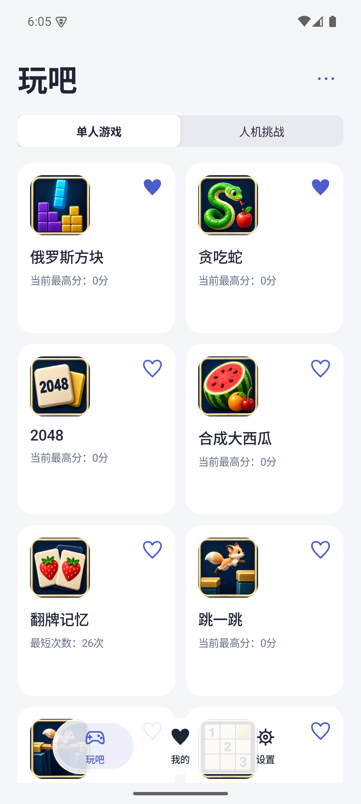
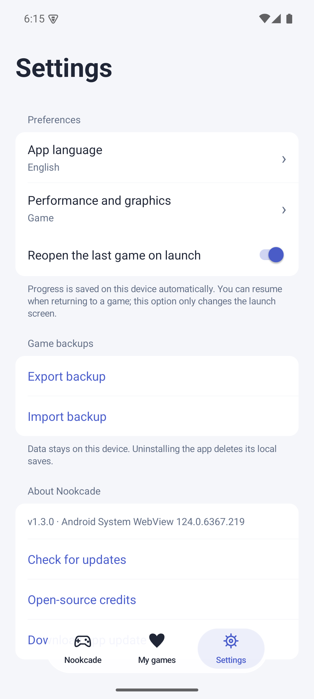

# 玩吧 1.3.0 跨端验收

验收日期：2026-09-09。Android 正式包为 1.3.0 / versionCode 7，内置内容 1.4.0 / content-10；iOS 为同版本源码的无签名 Simulator 构建。游戏代码源码为 `8d0d40f2387c3a062a697b93f4026562fc8ee02e`，Android 字体常量的发行检查修正为 `3b00578`。

## 已完成的检查

- 392 项共享代码与 Android 桥接自动化测试通过，包括存档、收藏排序、五语言、两款新游戏、更新与调用边界。Android 原生更新策略和更新器语言另有 8 项 Java 单元测试通过；关闭可选更新模块的两种内核构建通过。
- 两种正式 APK 的 assemble 与 lint 通过。独立校验 APK 非调试标志、版本、签名证书、两个更新开关、兼容版 GeckoView 155.0.1，以及全部 239 个随包文件与签名清单/源码的一致性。见 [发行完整性结果](evidence/android-1.3.0/release-integrity/apk-integrity.json)。
- content-10 的签名、8 个变化 ZIP 的 CRC/文件 SHA-256、73 个复用包元数据和全部 239 个资源文件通过独立校验；37 款游戏、81 个包，新增下载 537,804 字节。见 [内容校验](evidence/android-1.3.0/content-verification.json)。
- 1.2.2 / code 6 → 1.3.0 / code 7 的两种 APK 差分使用 Android 更新器 Java 实现独立重建，SHA-256 与完整 APK 完全一致，并再次验证 APK 签名。轻量版差分 4,168,667 字节、整包 62,149,094 字节；兼容版差分 8,005,670 字节、整包 226,380,162 字节。分别节省 93.29% / 96.46% 下载量。见 [轻量版](evidence/android-1.3.0/release-integrity/delta-system.json)、[兼容版](evidence/android-1.3.0/release-integrity/delta-compat.json)。这是实际发行输入的离线重建验证，设备上的系统安装交互另行记录。
- Android 模拟器与 HONOR Android 12 真机的原生首页、五语言、设置、Tab 点击和拖动经过实际触控检查。标题在选中前后保持固定布局；设置语言/性能可正常选择。模拟器另检查了横竖屏与原生下拉刷新。
- 首页自动更新通过真实 Android instrumentation 验证：仅测试 APK 提供受控版本元数据，检查游戏/文件面板/后台延后、合并列表、取消去重和两个真实页面入口；生产代码没有测试频道或信任覆盖入口。签名清单验证、线上内容下载和正式 APK 安装属于独立检查，不能用模拟元数据代替。
- 最终 system 正式 APK 已在模拟器覆盖安装，普通 SAF 导出与安装前五项数据完全一致。恢复测试前备份后，37 款进度、成绩、记录和数独数据精确一致；设置仅按本版设计将旧 night 归一为 day，并补空收藏和默认排序，其余保持一致。
- 真机以原生系统文件面板在覆盖安装前后导出备份，37 款游戏既有进度和记录一致。随后新方块实际暂存、硬降两块并获得 68 分，正常导出确认对应状态；没有卸载或清除应用数据。
- Android 模拟器实际完成新方块横屏控制、AI 出手、34 分冷启动续档，以及贪吃蛇摇杆、吃点、计时、暂停与结算。发现并修复了按住加速触发系统文字选择菜单的问题；修复后加速连续按住 1.6 秒、方块软降按住 1.8 秒均无菜单，操作和暂停正常。两款模式页也已修复横屏顶部裁切。通过普通 SAF 导出验证仅测试的两游戏进度变化，其余 35 款保持原样。见 [新游戏触控结果](evidence/android-1.3.0/games/result.json)。该组是同源码 Debug 的定向游戏测试，最终正式 APK 安装另记。
- 真机原生目录预热后 12 次滑动，共记录 386 帧，当前口径卡顿帧 0，旧口径 1；帧耗时 p95 为 7 ms。此值仅表示该次原生列表样本，不表示游戏帧率，也不能推导所有设备无卡顿。见 [匿名化指标](evidence/android-1.3.0/native-ui/physical-catalog-frame-metrics.json)。
- iOS 在真实 Simulator 的 UIKit / WKWebView 中完成 37 款启动、暂停、保存和弹球 WASM 就绪检查。系统透明 Tab 的冷启动、拖动、五语言、收藏排序、Files 备份导入导出，以及代表游戏触控结果见 [iOS 证据](../ios/evidence/README.md)。
- 同生产源码的 [iOS GitHub 构建](https://github.com/JackLee992/USER_HOUSE_ANDROID/actions/runs/34343994014)成功；[游戏内容仓库的公开发行验证](https://github.com/JackLee992/USER_HOUSE_GAME_PACKS/actions/runs/34343845926)也已完成签名和全部 81 包下载摘要检查。

## 真机与平台边界

HONOR 在本轮最后阶段断开，用户确认暂时无法重新连接。因此新贪吃蛇、方块横屏及最终正式 APK 安装尚未在该真机补测；不能把此前 Debug 包结果当作最终 Release 真机结果。真机测试前的原始备份安全保存在本地；断开前产生的方块测试进度尚未还原，后续应通过普通系统文件导入流程恢复。测试没有卸载或清除数据。

iOS 当前没有实体 iPhone/iPad、旧系统、长期耗电测试、签名 IPA、TestFlight 或 App Store 提交；模拟器 `.app` 不能直接发给普通 iPhone 用户安装。详细分发步骤见 [iOS 分发指南](ios-distribution.md)。所有 37 款启动检查不等于每款游戏的通关或性能测试。

## 界面样例

| Android 原生首页 | Android 英文设置 |
| --- | --- |
|  |  |

[Android 底栏拖动截图](evidence/android-1.3.0/native-ui/tab-drag.png) · [iOS 系统玻璃拖动](../ios/evidence/glass-drag-my-to-settings.png)

原始备份、设备标识、私人文件路径与完整设备日志只留在本地，不随公开证据发布。
