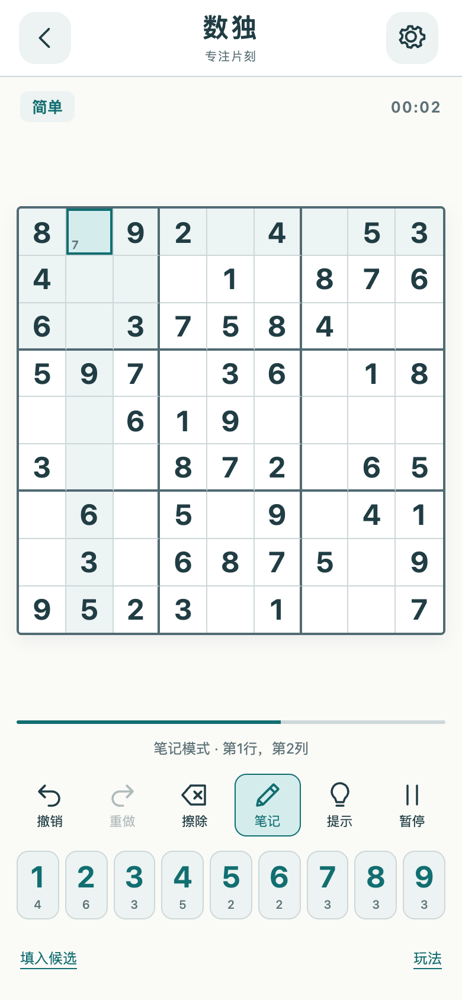
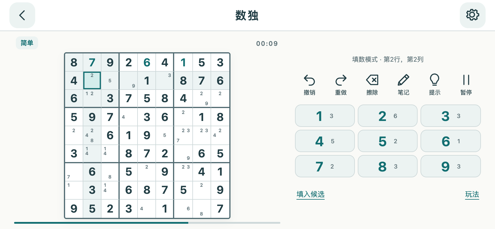

# 数独 1.1.0：产品升级与竞品对标

2026-09-09。主要竞品之一为 [Easybrain Sudoku.com](https://easybrain.com/sudoku)。本轮重做游戏界面和完整解题交互，保留现有离线宿主、用户存档与计分体系，通过独立游戏包分发。最新资源为 [1.3.1 / content-7](https://github.com/JackLee992/USER_HOUSE_GAME_PACKS/releases/tag/content-7)，数独包版本 1.1.0；已安装 App 1.2.0 或更新版本可在首页更新，APK 无需变化。

## 一手参考与取舍

| 来源 | 参考能力 | 本轮采用 |
| --- | --- | --- |
| [Easybrain 官方产品页](https://easybrain.com/sudoku) | 笔记、提示、重复数高亮、可选自动检查、主题，以及六档难度 | 核心解题辅助、清晰棋盘与可配置操作；本项目采用四档空格数量分档 |
| [Apple 数独操作指南](https://support.apple.com/guide/ipad/solve-sudoku-puzzles-ipadd406d521/ipados) | 自动清理同行列宫笔记、按当前填写计算候选、解释提示与揭示答案 | 自动候选不读取答案；清理可关闭；提示先解释再应用，揭示明确标识 |
| [Super Sudoku](https://github.com/TN1ck/super-sudoku) | 撤销/重做、笔记、数字计数、自动保存、手机与键盘操作 | 完整的输入、纠错和保存闭环，自行实现状态与界面 |

Easybrain 的每日挑战、季节活动和锦标赛暂未纳入本轮。四档难度不是按高级技巧评定，不宣称与其六档难度等同。Super Sudoku 采用 [MIT](https://github.com/TN1ck/super-sudoku/blob/master/LICENSE)；本次参考产品行为，界面、代码和题面生成均为本项目实现。

## 界面

象牙白与青绿色的经典九宫格，深色和单色适配；题面、填写、选中、同数、行列宫关联和冲突具有清楚层次。数字使用可缩放字体，工具使用统一 SVG 线条图标，候选固定在每格的 3×3 对应位置。

竖屏固定底部工具与数字区，横屏把操作放到右侧。游戏占满可用屏幕，Android 原生宿主支持沉浸模式。界面支持简体中文、繁体中文、英文、日文、韩文。

## 对标验收矩阵

以下“通过”对应模型、控制器及实际 Chrome 触控回归；Android 安装包内的验证另列于末尾，不能用桌面截图代替真机测试。

| 能力 | 实现与验收结果 |
| --- | --- |
| 清晰棋盘与手机布局 | 81 个稳定 DOM 格子；390×844、320×640、844×390 实测棋盘及工具完整可见，旋转不改进度 |
| 笔记 | 手动候选增删、填数清理本格笔记、题面不可改；3×3 标记布局、撤销/重做及重载保存通过 |
| 自动候选与自动清理 | 按当前填写计算，确认后一次事务替换全部笔记；填数和同行列宫清理一次撤销完整还原；可关闭清理 |
| 撤销与重做 | 填写、擦除、标记、批量候选均可恢复；新编辑清空 redo；默认上限 80 步，历史跨重载保存 |
| 提示 | 冲突、矛盾、唯一候选、区域唯一位置、明确揭示、完成、预算不足分别处理；显示说明后确认才填写，应用前重新核验 |
| 提示计数 | 显示带答案的说明即计一次帮助；取消不改棋盘；同一局面重复预览、预览后应用、保存恢复不重复计次；撤销不退还提示次数 |
| 自动检查 | 重复冲突始终有颜色、下划线及 aria-invalid；可选比较答案；旧多解题只显示规则冲突，合法替代分支不会误标 |
| 两种输入顺序 | 默认先格后数；数字优先支持选数后连续点格；方向键移动不意外填写，题面始终受保护 |
| 数字计数 | 数字键显示当前剩余数量；最小为 0；用完数字仍可用于纠错 |
| 四档新题 | 简单 30–35、中等 43–48、困难 53–58、专家 59–61 空格；192 组种子/档位及边界检查唯一解 |
| 暂停与退出 | 暂停隐藏棋盘、停计时并阻止触摸/键盘修改；冷重载恢复题面、填写、笔记、历史及选项 |
| 完成与记录 | 真实逐格输入完成一局，只记录一次，结构化保存得分和提示数；已填完的恢复局自动结算且幂等 |
| 五语与主题 | 五语游戏/设置截图已检查；夜间长文本无裁切；格子提供行列、题面、候选和冲突标签。完整 TalkBack 流程尚未实测 |
| 安静渲染 | 静止棋盘零新增绘制帧，时间只按秒更新；输入前后保留相同格子节点；销毁后无遗留绘制和计时 |

## 规则、存档与工程边界

`model.js` 管规则、生成、事务历史与提示；`index.js` 管控件和宿主生命周期；`styles.js` 管布局；`labels.js` 管五语纯文本。

新题使用四份本项目生成并验证过的 20 线索种子，通过保解变换和添加线索产生目标空格范围；搜索有预算，不以预算耗尽推断唯一解。当前不是完整技巧评级题库。

旧局保留原始题面、填写、难度、累计提示和时间。旧提示已经加入题面的数字无法可靠区分，维持既有语义。新加的笔记、历史、选项、预览计次信息兼容旧字段；包清单 `saveSchema=1` 保持不变。旧插件版本能够继续读取基础棋盘，但回退后重新保存会丢失它不认识的新笔记/历史字段，因此回退前应导出备份。

旧多解题在当前填写分支上求提示，并按行列宫实际合法性判定完成，不强迫等于旧缓存答案。只有求解证明唯一的题面允许与缓存答案比较；搜索预算不足也只显示规则冲突。

## 共用引擎

[共享游戏引擎说明](shared-game-engine.md)。祖玛实际使用共享 WebGL 层管理 GPU 上下文、程序、缓冲、纹理、两遍绘制与释放。数独使用同目录的按需渲染调度，通过 DOM 保持数字清晰和可访问性。

真实 Chrome 回归验证三档倍率、省电 Canvas、普通/游戏 WebGL，以及实际上下文丢失后的 Canvas 换球和射球。桌面结果不代表手机帧率或耗电测量。

## 验证入口与证据

- 完整宿主、内容发布和兼容内核最终回归：312/312 通过（content6 初始基线为311/311）。
- [模型测试](../tests/sudoku-model.test.mjs)：25/25 通过，含唯一解、候选、历史、旧局和提示计数。
- [控制器测试](../tests/sudoku-controller.test.mjs)：8/8 通过，含旧多解判错、完成恢复、暂停和清理。
- [实际浏览器触控脚本](../tests/sudoku-browser.mjs)及[完整结果](evidence/sudoku-1.1.0/browser/report.json)：候选/提示/设置/冷重载/自然完成/横竖屏/五语通过，运行时异常为 0。
- [深色设置](evidence/sudoku-1.1.0/browser/en-settings.png)、[窄屏](evidence/sudoku-1.1.0/browser/narrow.png)、[提示](evidence/sudoku-1.1.0/browser/logical-hint.png)、[完成记录](evidence/sudoku-1.1.0/browser/complete.png)。

## Android 原生验证

使用已安装、非调试的正式 APK 1.2.2 / code 6，全程采用普通 ADB 触控与系统文件选择器导出，不重新安装 APK、不清除数据。

| 设备 | 独立游戏更新及数独实测 |
| --- | --- |
| HONOR 真机，Android 12，兼容版 | content5→6 后正常备份的五项管理数据逐项全等、37 局保留；原局笔记 1/5 保存后恢复，撤销/重做通过；1080×2340 竖屏及2340×1080横屏完整可见；暂停输入及等待后两张截图均01:52且字节完全相同 |
| Android 15 模拟器，系统版 / WebView 124 | content5→6 五项全等；原局笔记、撤销/重做、冷启动续局均通过；暂停相隔约192秒的截图均04:16；横竖屏保持棋盘内容 |

测试最后清除测试候选，保留原题面、原填写与提示数；分数、记录和其余36局不变。游戏内正常测试会累计游玩时间和可撤销历史。正式APK哈希未变化。

[真机验证与截图](evidence/sudoku-1.1.0/phone/result.json) · [模拟器验证](evidence/sudoku-1.1.0/emulator/native-verification.json) · [真机横屏](evidence/sudoku-1.1.0/phone/sudoku-landscape.png) · [真机候选](evidence/sudoku-1.1.0/phone/sudoku-notes-portrait.png)。正常原始备份保留在私有 `.local`，公开证据使用哈希、结果与游戏截图。

## 内容更新状态修订

真机发现内容6已经正确激活，但首页可能仍显示“正在切换”并禁用检查按钮。原因是原生 `active` 通知到达时应用的事件入口尚未注册，更新面板保留了启动时的旧状态。

内容7在持久化健康确认通过、事件入口注册之后主动读取最新状态。保留健康确认之前的启动锁；仅 core 1.2.0→1.2.1 变化（426,229字节），其余80包逐字段复用内容6。

新增测试在旧启动代码上复现首个就绪页面仍禁用，在修复后通过。完整套件312/312通过；[真实浏览器更新回归](evidence/sudoku-1.1.0/content7-ready/result.json)还验证了无需切换焦点就显示就绪、下载与检查点、游戏中禁用更新、下拉刷新及回退触控。浏览器验证禁用旧缓存，并保留第一次旧执行源的诊断证据。

两台设备均通过 content6→7 的正常下载、安装与首次就绪页面验证：不切后台、不额外刷新焦点，直接显示资源1.3.1、游戏内容已就绪，检查按钮可用。正常导出的五项管理数据与各自更新前精确相等，全部37局保留；模拟器代理与两台设备旋转设置已恢复，均回到首页。具体哈希见上方原生报告。

真机另验证祖玛在最新资源中可见渲染正常：继续旧局、立即暂停、保存退出，分数250、生命3、已发射11次均保持，只有游玩时间正常增加。[祖玛真机画面](evidence/sudoku-1.1.0/phone/zuma-content7-visible.png)。此处是原生画面与进度验证，WebGL后台/FPS没有通过非调试APK测量。
